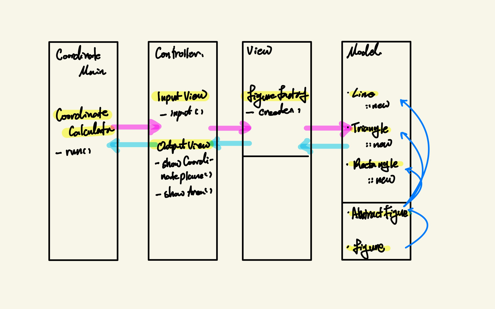

# 구현 코드 분석
## Model
- (I) Figure: 도형이 가져야 할 공통 메소드 선언
- (AC) AbstractFigure: 도형이 가져야할 메소드 중 공통된 로직이 적용되는 메소드를 구현 후 나머지를 넘겨주기.
- (C) Line, Triangle, Rectangle: AbstractFigure를 상속받아 미구현 메소드를 오버라이딩
- (C) Point: 좌표 저장 클래스. AbstractFigure을 상속받는 객체라면 모두 해당 클래스를 가진다.
- (C) FigureFactory: Point의 갯수에 따라 Figure의 인스턴스를 생성.

## View
- (C) InputView: 입력값을 받는 과정에서 필요한 문자열을 출력 & 입력받은 문자열을 검증 후 FigureFactory에 필요한 파라미터 형태-List of Points-로 변환
  - 입력값 요청
  - 입력값 포맷 검증
  - 문자열로부터 Points 생성
  - 서비스로직으로 파라미터 전달 -- FigureFactory.create()
  - 어떠한 형태로든 View 로직 처리 과정에서 예외 발생 시 처음부터 다시 실행
- (C) OutputView: 모델을 출력 요구사항에 맞게 변환 후 출력
  - 결과값을 좌표평면에 표현
  - 넓이값 출력

## Controller
- (C) CoordinateCalculator: 어플리케이션이 입력부터 출력까지의 로직을 순차적으로 실행할 수 있는 메소드 구현

## Application
- (C) CoordinateMain: 어플리케이션의 실행 메소드를 가진 유일한 클래스.  

---

# 요구 사항 분석

## 서비스 로직
1. 사용자가 좌표값을 입력한다.
2. 좌표값이 두 개인 경우, 직선으로 가정한다.
3. 좌표값이 세 개인 경우, 세 점을 연결하는 삼각형으로 가정한다.
4. 좌표값이 네 개인 경우, 네 점을 연결하는 사각형으로 가정한다.

## 기능 요구 사항
- 두 좌표 모두 0이상 24이하의 정수여야 한다.
- 좌표값과 좌표값 사이는 '-' 문자로 구분한다.
- 직선인 경우는 두 점 사이의 거리를 계산해서 출력한다.
- 삼각형인 경우, 삼각형의 넓이를 계산해서 출력한다.
- 사각형인 경우, 반드시 직사각형이여야 한다.
- 직사각형인 경우, 사각형 넓이를 계산해서 출력한다.
- Point 객체를 이용해 x,y 좌표를 관리한다.
- <b> 상속과 인터페이스를 사용해 중복 코드를 제거한다. </b>

## 😎 테스트 사항
> - 사용자가 입력한 좌표 정보 형태가 잘 못된 경우, 다시 입력을 받는다. 
    [(10,12)*(11,15) -> "좌표를 입력하세요."]
> - 좌표 하나가 주어졌을 때 Point 객체로 변환한다. 
> - 각 좌표의 값 범위는 0 미만이거나 24를 초과할 수 없다.
    [new Point(25,25) -> throws IllegalArgumentException -> "좌표를 입력하세요."]
> - 좌표를 입력했을 때, 주어진 좌표의 갯수를 확인하고, 분류한다. 
    [(10,10)-(10,12) -> return LINE]
> - 직선 좌표인 경우, 두 점 사이의 거리를 계산한다. 
    [(10,10)(14,15) -> return 6.403124]
> - 사각형 좌표인 경우, 네 점이 이루는 사각형이 직사각형이여야 한다. 
    [(10,11)-(22,10)-(22,18)-(10,18) -> throw IllegalArgumentException]
> - 직사각형 좌표에인 경우, 사각형의 면적을 계산한다.
    [(10,10)-(22,10)-(22,18)-(10,18) -> return 96]
> - 삼각형 좌표인 경우, 삼각형의 면적을 계산한다.
    [(10,10)-(14,15)-(20,8) -> 29.0]
> - 좌표가 주어졌을 때, 좌표의 갯수에 따라 특정 도형 / 선분을 호출한다
    [(10,10)-(14,15) -> new Line(), 
     (10,10)-(14,15)-(20,8) -> new Triangle(), 
     (10,10)-(22,10)-(22,18)-(10,18) -> new Rectangle()]

## 🧐 체크할 부분
<b>기억에 의존하기보다 논리에 입각해 설계하고 구현하기</b>

## 🤩 추가로 적용해 볼 부분
- Line을 Triangle, Rectangle과 구분하기: 연속된 abstract class 사용 괜찮음?

---

# 레퍼런스

